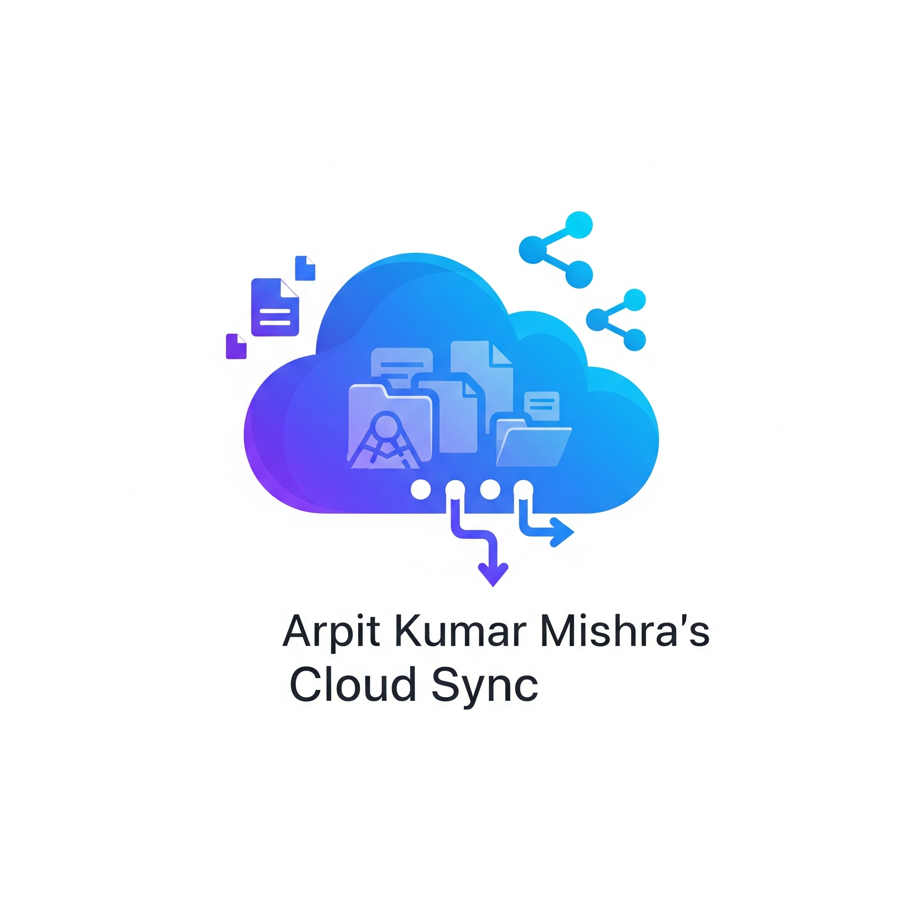
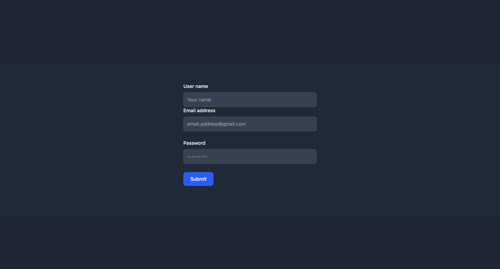
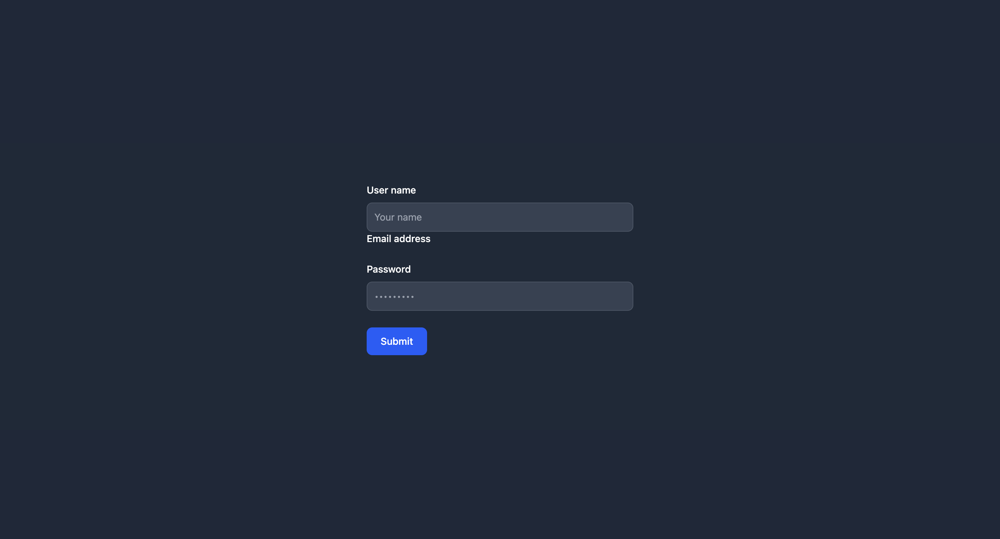
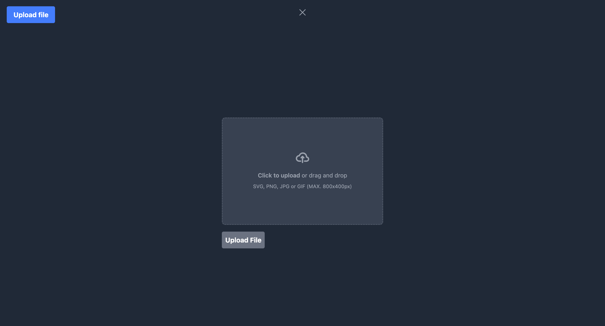

# Google Drive Clone



A full-stack clone of Google Drive built with Node.js, Express, MongoDB, and EJS. This project implements CRUD operations for user authentication and file management, integrating both frontend and backend seamlessly.

## Features

- User registration and login with JWT authentication






- File upload functionality



- Secure password hashing using bcrypt
- Responsive frontend using Tailwind CSS and Flowbite
- CRUD operations for users and files
- MongoDB integration for data persistence

## Technologies Used

- Node.js
- Express.js
- MongoDB & Mongoose
- EJS templating
- Tailwind CSS & Flowbite
- bcrypt
- jsonwebtoken
- express-validator

## Getting Started

### Prerequisites

- Node.js and npm installed
- MongoDB instance (local or cloud)

### Installation

1. Clone the repository:
    ```sh
    git clone https://github.com/yourusername/google_drive_clone.git
    cd google_drive_clone
    ```

2. Install dependencies:
    ```sh
    npm install
    ```

3. Create a `.env` file in the root directory and add your MongoDB URI and JWT secret:
    ```
    MONGO_URI=your_mongodb_connection_string
    JWT_SECRET=your_jwt_secret
    ```

4. Start the development server:
    ```sh
    npm start
    ```

5. Open [http://localhost:3000](http://localhost:3000) in your browser.

## Folder Structure

- `app.js` - Main application entry point
- `config/` - Database configuration
- `models/` - Mongoose models
- `routes/` - Express route handlers
- `views/` - EJS templates for frontend
- `assets/` - Static assets (images, etc.)

## License

This project is licensed under the ISC License.